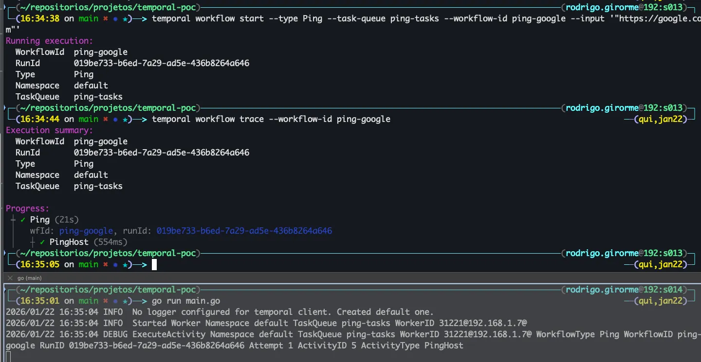

Temporal POC
---
Project to test [temporal.io](https://temporal.io/) event sourcing

## Pre reqs
- [Setup temporal and golang](https://learn.temporal.io/getting_started/go/dev_environment/)

---

### Start temporal cluster
```bash
$ temporal server start-dev --db-filename database/temporal.db
```

### Run worker
```bash
$ go run main.go
```

### Manual workflow
#### Start workflow
```bash
$ temporal workflow start --type Ping --task-queue ping-tasks --workflow-id ping-workflow --input '"https://google.com"'
```

#### Trace / show workflow progress
```bash
$ temporal workflow trace --workflow-id ping-google
```

output:


### Automatic workflow (and get result instead of fire and forget)
```bash
$ go run automatic-workflow/main.go
```